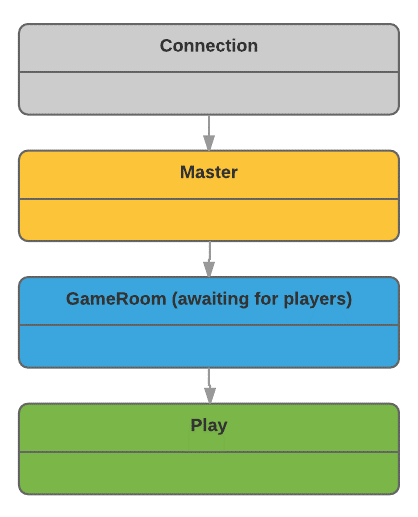
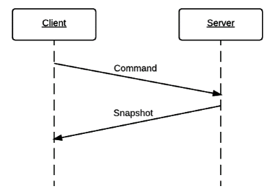
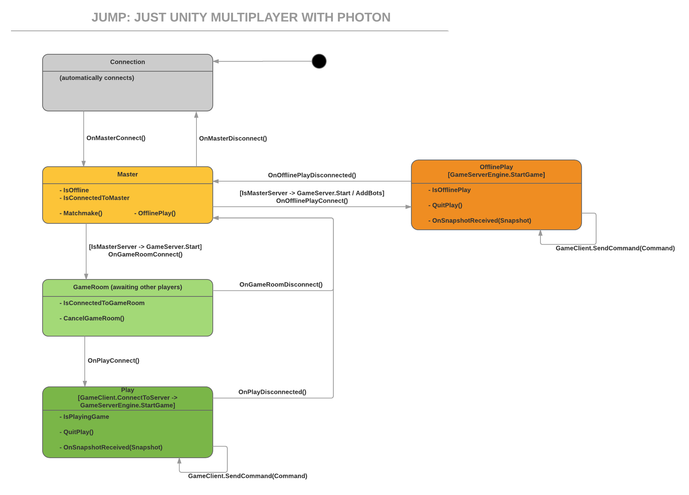

# JUMP (Just Unity Multiplayer with Photon)

**JUMP** is a library that facilitates writing **simple multiplayer games** using **[Unity 3D]** 
and **[Photon Unity Networking]**.

I was working on a multiplayer game and found myself in trouble trying to handle events from 
Unity and Photon at the same time; ending up with very confused and fragile code - so I worked to 
streamline and simplify the scenario (for my case) and build a library 
that I can reuse.

Out of the box, **JUMP** Provides:
- A simple flow for connecting to the server, matchmaking and starting a multiplayer game
- Authoritative local Server (using Photon Master Client)
- Streamlined Client-Server communication
- Custom Client Commands and Server Snapshots
- Sample Project and Prefabs to get started in 5 minutes
- Full source code access and great customization.

#### Version
0.1 [04/20/2016]

#### Table of Content
* **[How To Install](#how-to-install)**
* **[Scenario](#scenario)**
* **[Object Model](#object-model)**
* **[DiceRoller Sample](#diceroller-sample)**
* **[Testing JUMP](#testing-jump)**
* **[Features to Add](#features-to-add)**
* **[License](#license)**

# How to Install
You can get the source code here or download **JUMP** from the [Unity Asset Store][JUMPAsset].

#### Prerequisites
**JUMP** works with [Unity 5](https://unity3d.com/5) and requires [Photon PUN](https://www.assetstore.unity3d.com/en/#!/content/1786) to function properly:

1. Install [Photon PUN Free](https://www.assetstore.unity3d.com/en/#!/content/1786) or [Photon PUN+](https://www.assetstore.unity3d.com/en/#!/content/12080)
2. Configure your Photon Application ID - see [Initial Setup](https://doc.photonengine.com/en/pun/current/getting-started/initial-setup)

For more information about configuring PUN, see [PUN Setup](https://doc.photonengine.com/en/pun/current/getting-started/initial-setup).

> Note: JUMP was tested with Unity version 5.3.4 and Photon PUN Free version 1.67

#### Option 1: Unity Asset Store
Download JUMP from the [Unity Asset Store][JUMPAsset].

#### Option 2: From the source code
In alternative to use the Asset store, you can create a folder in the unity project (under Assets) and copy all the files from the `JUMP Multiplayer\` folder.

#### Verify installation
To test that JUMP works:

* Add all the scenes in the `DiceRollerSample/` to the Unity build
* Oopen the `DiceRollerConnection` scene and start Unity.

The DiceRoller sample should go to the Matchmake scene in connected mode.

> Note: To test multiplayer games in Unity, you will need to run two copies of the game, so that they can connect to each other. The best way, is to build a copy of the game (File/Build & Run) for one player and start Unity debugging for the second player. See this Unity [forum post](http://answers.unity3d.com/questions/214802/how-to-test-your-multiplayer-game.html) for more details.
 

# Scenario
The scenario supported by JUMP is very simple and designed with mobile multiplayer games in mind:
* [Two Players networking](#two-players-networking)
* [Basic matchmaking](#basic-matchmaking)
* [Streamlined UI flow](#streamlined-ui-flow)
* [Custom server](#custom-server)
* [Client-Server communication](#client-server-communication)

#### Two Players networking
JUMP automates building [Photon] rooms with two players, easy.
 
*Note:* While it can be extended to support more than two players, the support for UI flow is only for the two players scenario

#### Basic Matchmaking
JUMP supports a single [Photon Lobby] with [Random Matchmaking](https://doc.photonengine.com/en/realtime/current/reference/matchmaking-and-lobby).

#### Streamlined UI flow
JUMP supports up to five different Unity scenes:
* Connection
* Home Page (Master)
* Matchmaking Lobby
* [Room] Waiting for players
* [Room] Playing the game

*Note:* support for multiple levels can be added to the Playing the game scene. 



#### Custom Server
JUMP cannot provide a dedicated remote server using [Photon Unity Networking] or [Photon Cloud], so it uses the **Host** model, where one of the clients also hosts the Game Server (sometimes called **Local Server**) 

Photon provides support for this with the concept of [Master Client].

#### Client-Server Communication
JUMP supports the concept of an Authoritative or Semi-Authoritative server using a Command/Snapshot Client-Server communication:
* The Client sends Commands to the Server
* The Server sends Snapshot to the Client

The model is similar to the one explained by [Fast Paced Multiplayer] [Gambetta], but we use the term **Command** instead of Actions and **Snapshot** instad of New State



> The slanted lines indicate that there is lag between the client and server communication, see [Fighting Latency on Call of Duty III] [CallOfDuty]


While it is possible to optimize the client/server communication in terms of reliability and space utilized with delta compression of snapshots and queues of commands, JUMP simply uses 
[Photon Reliable UDP](https://doc.photonengine.com/en/onpremise/current/getting-started/photon-server-intro) to communicate, it is a good balance of reliability and ease-of-use.

#### References
JUMP Multiplayer with (Semi)Authoritative Server model is based on lots of literature on multiplayer games:
* [Fast Paced Multiplayer] [Gambetta]  (Gambetta)
* [What every programmer needs to know about game networking](http://gafferongames.com/networking-for-game-programmers/what-every-programmer-needs-to-know-about-game-networking/) (Gaffer on Games)
* [Fighting Latency on Call of Duty Black Ops III] [CallOfDuty]  (GDC 2016)
* [Building a Peer-to-Peer Multiplayer Networked Game](http://gamedevelopment.tutsplus.com/tutorials/building-a-peer-to-peer-multiplayer-networked-game--gamedev-10074)
* [Unity3D Multiplayer Game Development](http://www.pepwuper.com/unity3d-multiplayer-game-development-unity-networking-photon-and-ulink-comparison/)
* [How can I make a peer-to-peer multiplayer game?](http://gamedev.stackexchange.com/questions/3887/how-can-i-make-a-peer-to-peer-multiplayer-game/3891#3891)
* [Unity Networking](http://docs.unity3d.com/Manual/UNetConcepts.html)

# Object Model
JUMP Uses the following classes:
* [`JUMPMultiplayer`](#jumpmultiplayer)
* [`JUMPGameClient`](#jumpgameclient)
* [`JUMPGameServer`](#jumpgameserver)
* [`IJUMPGameServerEngine`](#ijumpgameserverengine)
* [`JUMPCommand`](#jumpcommand)
* [`JUMPCommand_Snapshot`](#jumpcommand_snapshot)
* [`JUMPPlayer`](#jumpplayer)
* [`JUMPOptions`](#jumpoptions)

#### JUMPMultiplayer
`JUMPMultiplayer` is the main class in **JUMP**, handling the connection to the server, the matchmaking, setting up the game room and managing the game client and server. 
`JUMPMultiplayer` inherits from [`Photon.PunBehaviour`](http://doc-api.exitgames.com/en/pun/current/class_photon_1_1_pun_behaviour.html), which in turn extends `UnityEngine.MonoBehaviour` to interact both with Photon Networking and Unity Scenes.

To use `JUMPMultiplayer`, you place it on a Unity Scene, set the `Stage` property and handle the UnityEvents that are raised by loading other scenes and setting a different Stage or issuing commands. See [DiceRoller Sample](#diceroller-sample) for an example.

To facilitate development, **JUMP** provides a series of **JUMPMultiplayer Prefabs** see details [here](#jumpmultplayer-prefabs) 

##### `JUMPMultiplayer.Stage`
`JUMPMultiplayer` works in stages, one for each of the [Steamlined UI flow](#streamlined-ui-flow)

```c#
public enum Stages
{
    Connection,
    Master,
    MatchmakeLobby,
    GameRoom,
    Play
}
```

At high level the `Stages` state diagram is the following:



In more detail, based on the current stage, `JUMPMultiplayer` provides the following events and operations:
##### `Stages.Connection`
In the `Connection` stage, JUMP will try to connect to Photon Server, using the [Photon connection settings](https://doc-api.photonengine.com/en/pun/current/class_photon_network.html#a0fdb79bcce45801ec81fbe56ffb939ec):

When the connection is established, the `OnMasterConnnect` event is raised:
```c#
public UnityEvent OnMasterConnect;
```
You respond to the event by loading a different Unity Scene with a `JUMPMultiplayer` object set in to the `Master` stage.
Note that if the connection fails, then the `OnMasterConnect` event is raised, but the `JUMPMultiplayer.IsOffline` property is set to true.
##### `Stages.Master`
The `Master` stage is the main screen one, the user is connected to Photon, but not yet into a matchmaking queue or in a game room.
While connected to the Photon Master server (but not in a Lobby or Room), the `JUMPMultiplayer.IsConnectedToMaster` property will be set to `true`.

To start the matchmaking proces, you call the `Matchmake` operation:
```c#
public void Matchmake()
```
This triggers the request to connect to the default [Photon Matchmaking Lobby](https://doc.photonengine.com/en/realtime/current/reference/matchmaking-and-lobby) for your game.

When the connection succees, the `OnMatchmakeLobbyConnect` event is fired. You want to handle this event by loading the Mathcmaking scene.
```c#
public UnityEvent OnMatchmakeLobbyConnect;
```

If the connection fails or we lose connection to the PhotonServer, then the `OnMasterDisconnect` event is fired. You want to handle this event by going back to the 'Connection' scene to try and reconnect once - if reconnection fails, you will be navigate again to the main scree with the `IsOffline` property set to true - in which case, you want to tell your users that they are offline. 
```c#
public UnityEvent OnMasterDisconnect;
```
##### `Stages.MatchmakeLobby`
In the Matchmake lobby, JUMP will try to matchmake to a [Photon Game Room](https://doc.photonengine.com/en/realtime/current/reference/matchmaking-and-lobby) using Randon matchmaking.
While connected to the Photon Lobby, the `JUMPMultiplayer.IsConnectedToMatchmakeLobby` property will be set to `true`.

You can cancel the attempt to matchmake by calling the `CancelMatchmake` operation:
```c#
public void CancelMatchmake()
```
This will cancel the request to matchmake and raise the `OnMatchmakeLobbyDisconnect` event:
```c#
public UnityEvent OnMatchmakeLobbyDisconnect;
```
The `OnMatchmakeLobbyDisconnect` is also triggered in case of loss of connection to Photon.
You want to handle this event by going back to the Main screen ([`Stages.Master`](#stagesmaster))

When a game room is found then the `OnGameRoomConnect` event is fired:
```c#''
public UnityEvent OnGameRoomConnect;
```
If no room is not found, then one is created and the user is joined to it waiting for other players. The same `OnGameRoomConnect` event is fired.
You want to handle this even by loading a scene that tells the users they are waiting for the other player to connect.

When the client connects to the Game Room, an instance of the [`JUMPGameServer`](#jumpgameserver) is created - this will invoke your custom Server Engine. Just implement the [`IJUMPGameServerEngine`](#ijumpgameserverengine) interface in your class and provide the name of the class (including the namespace) to the `GameServerEngineTypeName` property:
```c#
public string GameServerEngineTypeName;
```
##### `Stages.GameRoom`
In this stage, the player is connected to a [Photon Game Room](https://doc.photonengine.com/en/realtime/current/reference/matchmaking-and-lobby) and waiting for the room to be full with two players.
While connected to the Game Room, the `JUMPMultiplayer.IsConnectedToGameRoom` property will be set to `true`.

You can cancel the action and get out of the Game Room, by calling the `CancelGameRoom` operation:
```c#
public void CancelGameRoom()
```
This will cancel the Game Room request and raise the `OnGameRoomDisconnect` event:
```c#
public UnityEvent OnGameRoomDisconnect;
```
The `OnGameRoomDisconnect` event is also triggered if you lose connection to Photon. You want to handle this event by going back to the Main screen ([`Stages.Master`](#stagesmaster)).

When the second player connects, then the `OnPlayConnect` event is fired:
```c#
public UnityEvent OnPlayConnect;
```
The `OnPlayConnect` event is also fired if the room is already present and you are joining as the second player; in this case you will not have the time to cancel the game room request.
You want to handle the `OnPlayConnect` event by going to the Game Play scene.
##### `Stages.Play`
This is the stage where the play happens, both players are joined to a Photon Game Room and exchanging commands and snapshots with the server to play the game. While in the Play stage, the `JUMPMultiplayer.IsPlayingGame` variable is set to true; note that this is a combination of both the `IsConnectedToGameRoom` and `IsRoomFull` properties.

You can cancel the game and get out of the room by calling `QuitPlay`:
```c#
public void QuitPlay()
```
This will exit the game room and trigger the `OnPlayDisconnected` event:
```c#
public UnityEvent OnPlayDisconnected;
```
The `OnPlayDisconnected` event is also fired if the other player leaves the room or if you lose connection to Photon.
You want to handle the `OnPlayDisconnected` event by telling the user the reason for the disconnection (using the `QuitGameReason` property) and then moving back to the Main screen ([`Stages.Master`](#stagesmaster)).

When `JUMPMulyiplayer` enters in the Play stage, then the [`JUMPGameClient`](#jumpgameclient) is initialized. At this point the client connects to the [`JUMPGameServer`](#jumpgameserver) that in turn starts sending **Snapshots** to the client.
The `JUMPMultiplayer` will raise an `OnSnapshotReceived` event every time an snapshot is sent from the server to the client.
For more information on how to handle the Snapshots, see the [`JUMPGameServer`](#jumpgameserver) section.
```c#
public JUMPSnapshotReceivedUnityEvent OnSnapshotReceived;
```
#### JUMPMultplayer Prefabs
The _/JUMP/Multiplayer_ folder contains five prefabs, one for each of the [Stages](#jumpmultiplayerstage).
The prefabs are:
* JUMPMultiplayerConnection
* JUMPMultiplayerMaster
* JUMPMultiplayerMatchmakeLobby
* JUMPMultiplayerGameRoom
* JUMPMultiplayerPlay

The prefabs are simply a Game Object with a `JUMPMultiplayer` component set to the relative `Stage`. The idea is to place these in each of the five scenes that will compose the [UI Flow](#streamlined-ui-flow)

#### JUMPGameClient
`JUMPGameClient` uses the singleton pattern, to access it, use the `Singleton<JUMPGameClient>.Instance` property.

You use the `JUMPGameClient` to send commands to the server; to do so, just use the `SendCommandToServer` operation. To define your own commands, see [`JUMPCommand`](#jumpcommand).
```c#
Singleton<JUMPGameClient>.Instance.SendCommandToServer(new myCommand());
```

The `ConnectToServer` operation and `OnSnapshotReceived` event are used internally by `JUMPMultiplayer`, you don't need to worry about them :)

#### JUMPGameServer
The `JUMPGameServer` is managed by the `JUMPMultiplayer` class, you don't interact with it directly.
`JUMPMultiplayer` uses a singleton `JUMPGameServer` insance to start the game, process client commands and send snapshots to the client.

The `JUMPGameServer` will send a numbe of snapshots to the client per second that can be customized setting the `JUMPOptions.SnapshotsPerSec` property, the default is 3 snapshots per second.

The `JUMPGameServer` is designed to interact with your custom Server Engine - just implement the [`IJUMPGameServerEngine`](#ijumpgameserverengine) interface and set the `GameServerEngineTypeName` property of a `JUMPMultiplayer` instance with Stage [`Stages.MatchmakeLobby`](#stagesmatchmakelobby) (or a *JUMPMultiplayerMatchmakeLobby* prefab).

#### IJUMPGameServerEngine
The `IJUMPGameServerEngine` interface allows you to customize the Server Engine for your multiplayer game.
An instance of your Server Engine will be hosted by the [Master Client], all the communication between client and server is being taken care of by **JUMP**, you can focus on implementing your game logic.

Here is the `IJUMPGameServerEngine` interface:
```c#
public interface IJUMPGameServerEngine
{
    void StartGame(List<JUMPPlayer> Players);
    void Tick(double ElapsedSeconds);
    void ProcessCommand(JUMPCommand command);
    JUMPCommand CommandFromEvent(byte eventCode, object content);
    JUMPCommand_Snapshot TakeSnapshot(int ForPlayerID);
}
```

###### `void StartGame(List<JUMPPlayer> Players)`
**JUMP** will call StartGame when the `JUMPMultiplayer` is in the `MatchmakeLobby` stage and the player joins (or creates) a Room, right before calling `OnGameRoomConnect`.
In this operation, you want to initialize your game state, using the information on the `Players` list to save the list of players that are in the game.

For example, the [DiceRoller Custom Server](#diceroller-customs-erver) intializes its own GameState and saves the players using a custom DiceRollerPlayer class.

###### `void Tick(double ElapsedSeconds)`
On the Master Server, `JUMPGameServer` calls `Tick` every frame update to make your game progress forward.
Do anything time related in this operation; don't bother sending Snapshots, this is automated for you with the `TakeSnapshot` operation.

For example, the [DiceRoller Custom Server](#diceroller-customs-erver) counts down its 30 seconds timeout for the game, after that the game is over.

###### `void ProcessCommand(JUMPCommand command)`
This is where you process your custom commands that the client sends.

See [JUMPCommand](#jumpcommand) for how to define your own commands and the [DiceRoller Custom Server](#diceroller-customs-erver) for an example of definition and use of a custom command.

###### `JUMPCommand CommandFromEvent(byte eventCode, object content)`
`JUMPGameServer` needs a way to find out if the Photon Event that it just received from the client comes from your Game Client and carries your custom command, in order to do so, you can implement the `CommandFromEvent` function, checking if the `eventCode` is one of your custom operations' one.

See, the [DiceRoller Sample](#diceroller-customs-erver) for an example on how to write this function.

###### `JUMPCommand_Snapshot TakeSnapshot(int ForPlayerID)`
`JUMPGameServer` will send Snapshots automatically to your clients; the `TakeSnapshot` function is where you can customize the Snapshot.

See, the [DiceRoller Custom Server](#diceroller-customs-erver) for an example on how to write this function.

#### JUMPCommand
`JUMPCommand` is a base class that allows **JUMP** to define commands and to send them and receive them using the Photon Events system. You can define your own custom commands with little coding.

`JUMPCommand` uses the `CommandEventCode` property as Photon Event Code, this is a byte variable, in your game you can use any value from `0` to `189`.
The `CommandData` is an object array used to store and retrieve the data for your command, and that can be easily serialized with Photon messages. Only basic types are allowed as Command properties to store in `CommandData`, for more background information, see [Serialization In Photon](#https://doc.photonengine.com/en/realtime/current/reference/serialization-in-photon)

Custom `JUMPCommand`s typically need two constructors, one used for reconstruction of the Command when received from Photon, and one used to initialize the CommandData before sending it to the server.

`JUMPMultiplayer` uses `JUMPCommand_Connect` as a custom command used to connect the `GameClient`:
```c#
public class JUMPCommand_Connect : JUMPCommand
{
    public const byte JUMPCommand_Connect_EventCode = 191;

    public int PlayerID { get { return (int)CommandData[0]; } set { CommandData[0] = value; } }

    public JUMPCommand_Connect(int playerID) : base(new object[1], JUMPCommand_Connect_EventCode)
    {
        PlayerID = playerID;
    }

    public JUMPCommand_Connect(object[] data) : base(data, JUMPCommand_Connect_EventCode)
    {
    }
}
```

See, the [DiceRoller Custom Server] for other examples on wiritng your own custom Commands.

#### JUMPCommand_Snapshot
Then the `JUMPGameServer` sends `JUMPCommand_Snapshot` periodically to the client.
`JUMPCommand_Snapshot` is a `JUMPCommand` that has two property already set: the `JUMPSnapshot_EventCode` and the `ForPlayerID` property.

You can define your own Snapshot, by inheriting from the `JUMPCommand_Snapshot` class - 

See, the [DiceRoller Custom Server] for other examples on wiritng your own custom Snapshots.

#### JUMPPlayer
`JUMPPlayer` is a simple class used to store basic information like `PlayerID` and `IsConnected`.
You can extend the `JUMPPlayer` with your own properties, like Score for example and keep them in your server state.

See, the [DiceRoller Custom Server] for an example on extendig the `JUMPPlayer` class.

#### JUMPOptions
You can set a few options with the `JUMPOptions` class - here are the options with their defaults:

```c#
public static class JUMPOptions
{
    public static string GameVersion = "0.1";
    public static byte NumPlayers = 2;
    public static int DisconnectTimeout = 10 * 1000;
    public static int SnapshotsPerSec = 3;
}
```

Note that `DisconnectTimeout` is set to 60 seconds if the build is in Debug mode.

# DiceRoller Sample
DiceRoller is a simple example of how to use **JUMP**.
It is made of five scenes, a custom Server Engine and a Game Manager for the play scene.

#### Connection Scene
The Connection Scene has one instance of the **JUMPMultiplayerConnection** [prefab](#jumpmultiplayerprefabs) (as a reminder,  this is a behaviour that has a `JUMPMultplayer` component, with the `Stage` set as `Connection`).

The only event handled by the scene the `OnMasterDisconnect`, in which we load the Master Scene.

The Scene also uses the UI Prefab **JUMPStatusConnection** that displays the status of the connection with Photon.

#### Master Scene
The Master Scene has has one instance of the **JUMPMultiplayerMaster** prefab.

The scene handles two events:
* `OnMasterDisconnect` that goes back to the Connection Scene to try and reconnect once.
* `OnMatchmakeLobbyConnect` that loads the Matchmake Lobby Scene

The scene uses a few more UI prefabs:
* **JUMPStatusOnline** that displays if the client is online (connected with Photon) or offline
* **JUMPStatusDefaultLobby** that displays the number of players connected to the Photon Lobby
* **JUMPButtonMatchmake** a simple text button that is enabled when we are connected to the Photon Master Server; if the user clicks the button, then we invoke the `Matchmake` operation on the **JUMPMultiplayerMaster** prefab.

#### Matchmake Lobby Scene
The Matchmake Lobby Scene has has one instance of the **JUMPMultiplayerMatchmakeLobby** prefab.

The scene handles two events:
* `OnMatchmakeLobbyDisconnect` that goes back to the Master Scene.
* `OnGameRoomConnect` that loads the Game Room Scene

It also sets the `GameServerEngineTypeName` variable to `"DiceRollerSample.DiceRollerEngine"` to create a custom server engine - for details see the [DiceRoller Custom Server].

The scene uses a few more UI prefabs:
* **JUMPButtonCancelMatchmake** which is enabled during this phase of the UI Flow. If the user clicks the button, then we invoke the `CancelMatchmake` operation on the **JUMPMultiplayerMatchmakeLobby** prefab.

#### Game Room Scene
The Game Room Scene has one instance of the **JUMPMultiplayerGameRoom** prefab.

The scene handles two events:
* `OnGameRoomDisconnect` that goes back to the Master Scene.
* `OnPlayConnect` that loads the Play Scene

The scene uses a few more UI prefabs:
* **JUMPStatusGameRoom** that displays how many players are in the room.
* **JUMPButtonCancelGameRoom** which is enabled during this phase of the UI Flow. If the user clicks the button, then we invoke the `CancelGameRoom` operation on the **JUMPMultiplayerGameRoom** prefab.

#### Play Scene
The Game Room Scene has one instance of the **JUMPMultiplayerPlay** prefab.

The scene handles two events:
* `OnPlayDisconnect` that goes back to the Master Scene.
* `OnSnapshotReceived` that handles the Snapshots form the server via the DiceRollerGameManager - see [DiceRoller Custom Server] for details

The scene uses a few more UI prefabs:
* **JUMPButtonQuitPlay** hich is enabled during this phase of the UI Flow. If the user clicks the button, then we invoke the `QuitPlay` operation on the **JUMPMultiplayerPlay** prefab.

### DiceRoller Custom Server
DiceRoller is a simple game, two players roll a dice and try to score the most points in 30 seconds.
To function, DiceRoller needs the Scenes and two additional components:
* Gustom Server
* Game Manager script for the Play Scene

> Note: for simplicity of implementation, the action of rolling a dice is non-authoritative: the clients decide the outcome of rolling the dice autonomously; this helps keeping the DiceRoller sample code very straightforward and simple to understand. In your game you might want to have the server take the decisions on the outcome of player actions like this.

#### Custom Server
To create a custom server, DiceRoller implements the [`IJUMPGameServerEngine`](#ijumpgameserverengine) interface:

##### DiceRollerCommand_RollDice
DiceRoller defines a custom command for rolling the dice, this inherits from `JUMPCommand` and extends it:

```c#
public class DiceRollerCommand_RollDice : JUMPCommand
{
    public const byte RollDice_EventCode = 100;

    public int PlayerID { get { return (int)CommandData[0]; } set { CommandData[0] = value; } }
    public int RolledDiceValue { get { return (int)CommandData[1]; } set { CommandData[1] = value; } }

    // Create a command to send with this initializer
    public DiceRollerCommand_RollDice(int playerID, int rolledDiceValue) : base(new object[2], RollDice_EventCode)
    {
        PlayerID = playerID;
        RolledDiceValue = rolledDiceValue;
    }

    // Create a command when receiving it from Photon
    public DiceRollerCommand_RollDice(object[] data) : base(data, RollDice_EventCode)
    {
    }
}
```

Note the definition of the event code: `RollDice_EventCode`, the use of the standard `PlayerID` property as the first value in the CommanData array and the definition of two constructors: `DiceRollerCommand_RollDice(object[] data)` used to create the command from the Photon message and `DiceRollerCommand_RollDice(int playerID, int rolledDiceValue)` used to send the message.

##### DiceRollerPlayer
DiceRoller defines a custom Player to store the game state in [`DiceRollerGameState`](#dicerollergamestate).

```c#
public class DiceRollerPlayer : JUMPPlayer
{
    public int Score = 0;
}
```

Note the inheritance from `JUMPPlayer` and the addition of the only property that matters in this case, the Score.

##### DiceRollerGameState
DiceRoller custom server defines theits own game state of course - this contains a list of `DiceRollerPlayers`, the time remaining in the game, the stage of the game (can be waiting for the players, playing or complete) and the time remaining when the game is being played:

```c#
public enum DiceRollerGameStages
{
    WaitingForPlayers,
    Playing,
    Complete
}

public class DiceRollerGameState
{
    public Dictionary<int, DiceRollerPlayer> Players = new Dictionary<int, DiceRollerPlayer>();
    public float SecondsRemaining;
    public DiceRollerGameStages Stage;
    public int WinnerPlayerID;
}
```

##### DiceRoller_Snapshot
To communicate the state of the game with the clients, the DiceRoller custom server must define a Snapshot.
The `DiceRoller_Snapshot` class inherits from `JUMPCommand_Snapshot` and so can make use of the array of data `CommandData`, the `JUMPSnapshot_EventCode` and the `ForPlayerID` properties already defined in the base class.

All it needs to do is to define two constructors and use the `CommandData` array to store the Snapshot data.

Note that a Snapshot is different from the GameState because it is aimed to only one of the two players: players should not see each other's data (for example if they have playing cards). 

```c#
public class DiceRoller_Snapshot : JUMPCommand_Snapshot
{
    // ForPlayerID is at CommandData[0]
    public int MyScore { get { return (int)CommandData[1]; } set { CommandData[1] = value; } }
    public int OpponentScore { get { return (int)CommandData[2]; } set { CommandData[2] = value; } }
    public float SecondsRemaining { get { return (float)CommandData[3]; } set { CommandData[3] = value; } }
    public DiceRollerGameStages Stage { get { return (DiceRollerGameStages)CommandData[4]; } set { CommandData[4] = value; } }
    public int WinnerPlayerID { get { return (int)CommandData[5]; } set { CommandData[5] = value; } }

    // Create a command to send with this initializer
    public DiceRoller_Snapshot() : base(new object[6])
    {
    }

    // Create a command when receiving it from Photon
    public DiceRoller_Snapshot(object[] data) : base(data)
    {
    }
}
```

Note how the `DiceRoller_Snapshot()` constructor creates a new array with 6 elements: one for the `ForPlayerID` property used by the `JUMPCommand_Snapshot` base class and five for the custom properties.
Also note how the properties are stored from the second element in the array on, because `ForPlayerID` is stored at element 0.

##### DiceRollerEngine
The `DiceRollerEngine` class implements the `IJUMPGameServerEngine` interface.

It uses an internal variable to hold the state:

```c#
private DiceRollerGameState GameState;
```

The constructor simply initializes the state in the waiting for players mode:

```c#
public DiceRollerEngine()
{
    GameState = new DiceRollerGameState();
    GameState.Stage = DiceRollerGameStages.WaitingForPlayers;
}
```

The `CommandFromEvent` function handles the RollDice custom command:

```c#
public JUMPCommand CommandFromEvent(byte eventCode, object content)
{
    if (eventCode == DiceRollerCommand_RollDice.RollDice_EventCode)
    {
        return new DiceRollerCommand_RollDice((object[]) content);
    }
    return null;
}
```

The `StartGame` operation gets the information about the players and sets the state of the game:

```c#
public void StartGame(List<JUMPPlayer> Players)
{
    GameState = new DiceRollerGameState();
    GameState.SecondsRemaining = 30;
    GameState.Stage = DiceRollerGameStages.Playing;

    foreach (var pl in Players)
    {
        DiceRollerPlayer player = new DiceRollerPlayer();
        player.PlayerID = pl.PlayerID;
        player.IsConnected = pl.IsConnected;
        player.Score = 0;

        GameState.Players.Add(player.PlayerID, player);
    }
}
```

The `ProcessCommand` handles the server state when a client sends a RollDice command (the connect commands are manager automatically by the `JUMPGameServer` class).

```c#
public void ProcessCommand(JUMPCommand command)
{
    if (command.CommandEventCode == DiceRollerCommand_RollDice.RollDice_EventCode)
    {
        DiceRollerCommand_RollDice rollDiceCommand = command as DiceRollerCommand_RollDice;

        DiceRollerPlayer player;
        if (GameState.Stage == DiceRollerGameStages.Playing)
        {
            if (GameState.Players.TryGetValue(rollDiceCommand.PlayerID, out player))
            {
                player.Score += rollDiceCommand.RolledDiceValue;
            }
        }
    }
}
```

The `Tick` operation handles the game clock, when the clock expires, the game state is changed to Coplete and a winner is determined.

```c#
public void Tick(double ElapsedSeconds)
{
    if (GameState.Stage == DiceRollerGameStages.Playing)
    {
        GameState.SecondsRemaining -= (float) ElapsedSeconds;
        if (GameState.SecondsRemaining <= 0)
        {
            int maxscore = 0;
            int winner = -1;
            foreach (var item in GameState.Players)
            {
                if (item.Value.Score > maxscore)
                {
                    maxscore = item.Value.Score;
                    winner = item.Key; 
                }
            }
            GameState.Stage = DiceRollerGameStages.Complete;
            GameState.WinnerPlayerID = winner;
        }
    }
}
```

The `TakeSnapshot` operation is called by `JUMPGameServer` to send the snapshot to a player, so the snapshot is created for that specific player:

```c#
public JUMPCommand_Snapshot TakeSnapshot(int ForPlayerID)
{
    DiceRoller_Snapshot snap = new DiceRoller_Snapshot();
    snap.ForPlayerID = ForPlayerID;
    snap.MyScore = 0;
    snap.OpponentScore = 0;
    foreach (var item in GameState.Players)
    {
        if (item.Value.PlayerID == ForPlayerID)
        {
            snap.MyScore = item.Value.Score;
        }
        else
        {
            snap.OpponentScore = item.Value.Score;
        }
    }
    snap.SecondsRemaining = GameState.SecondsRemaining;
    snap.Stage = GameState.Stage;
    snap.WinnerPlayerID = GameState.WinnerPlayerID;

    return (JUMPCommand_Snapshot) snap;
}
```

#### Game Manager
The final piece of **DiceRoller** is the `DiceRollerGameManager`, this is the Controller part in the MVC pattern: displaying the information in the user interface (View) and working with the `Snapshot` (Model) received by the `JUMPMultiplayer` class (see [Play Scene](#play-scene)).

'DiceRollerGameManager' is a 'MonoBehaviour' and uses multiple `Text` and `Button` controls to display and control the game:

```c#
public Text MyScore;
public Text TheirScore;
public Text GameStatus;
public Text TimeLeft;
public Text Result;
public Button RollDice;
```

When a snapshot is received, the controls are updated:

```c#
DiceRollerGameStages UIStage = DiceRollerGameStages.WaitingForPlayers;

public void OnSnapshotReceived(JUMPCommand_Snapshot data)
{
    DiceRoller_Snapshot snap = new DiceRoller_Snapshot(data.CommandData);
    GameStatus.text = snap.Stage.ToString();
    MyScore.text = snap.MyScore.ToString();
    TheirScore.text = snap.OpponentScore.ToString();
    TimeLeft.text = snap.SecondsRemaining.ToString("0.");
    UIStage = snap.Stage;
    if (UIStage == DiceRollerGameStages.Complete)
    {
        Result.text = (snap.MyScore > snap.OpponentScore) ? "You Won :)" : ((snap.MyScore == snap.OpponentScore) ? "Tied!" : "You Lost :(");
    }
}
```

The user can roll a dice, this operation will send the custom command to the server using the `JUMPGameClient` singleton:

```c#
public void RollADice()
{
    int score = UnityEngine.Random.Range(1, 6);
    if (RollDice != null)
    {
        RollDice.GetComponent<Text>().text = "Rolled a " + score + " \nroll again.."; 
    }
    Singleton<JUMPGameClient>.Instance.SendCommandToServer(new DiceRollerCommand_RollDice(PhotonNetwork.player.ID, score));
}
```

Finally, the Unity `Start` function is used to initialize the random seed and in the `Update` function we enable the RollDice button only if we are playing:

```c#
// Use this for initialization
void Start () {
    UnityEngine.Random.seed = System.DateTime.Now.Millisecond;
}

// Update is called once per frame
void Update () {
    RollDice.interactable = (UIStage == DiceRollerGameStages.Playing);
}
```

# Testing JUMP
Given the fact that Unity does not allow the same project to be opened in two different instances of the Unity Editor and that it can only run one scene at a time, it is very hard to create test automation and to test **JUMP**.
We have done manual testing, but finding a way to automate some of this test would be ideal.
We thought about mocking, but then it would require to mock the behaviour of Photon, making assumptions that might not be matched in the real case and invalidating the tests.

So we worked with manual tests so far, here are the test cases we tried:

##### Start the game
* Start a Game from the Connection Scene -> the Game should end in the Master  scene with Offline mode on.
* Start a Game from any other scene -> the Game should go back to the connection Scene and then end in the Master scene with Offline mode on.
* Start a Game with no connection from any Scene -> the Game should end in the Master scene with Offline mode on.

##### Disconnect from the game
* When on any scene, disconnect the network -> the Game should go back to the connection Scene and then end in the Master  scene with Offline mode on.  

##### Matchmake
* When on the Master scene, press Matchmake -> the Game should go to the Matchmake screen then the Game should go to the Game Room waiting scene; if there is at least another player in matchmaking, then the game should go to the Play scene.
* When on the Matchmake scene if the user press Cancel Matchmaking -> the Game should go back to the main scene; if there is at least another player in matchmaking, then the game should continue on to the Play scene.

##### Game Room waiting
* When on the Game Room waiting scene, if the user press Cancel -> the game should go back to the Master scene

##### Play
* When on the Play scene, if the user press Quit -> the game shouls go back to the Master scene


# Features to add
* Unit test, or at least automation test (with Unity allowing a single window and a single instance this is hard)
* Support for bots when there are not enough players online (users in a room by himself for too long)
* Improved reliability and speed with delta compression of Snapshots and list of not-acknowledged Commands.
* Matchmaking not random but with customizable criteria (SQLLobbies)
* Source Code comments on public variables and methods?


---

# License

Unless stated otherwise all works are Copyright &copy; 2016 [Juiced Team LLC.](http://www.juicedteam.com)

And licensed under the [MIT License](./LICENSE.txt)

### Donate
If you want to donate, you can simply [purchase the JUMP package in the Unity Asset Store][JUMPAsset].

### Contribute
We are not ready to accept pull requests at the time, we are considering that for the future.
If you are interested in contributing, file a bug and we will consider your request.
All contributions will be voluntary and will grant no rights, compensation or license, you will retain the rights to reuse your code.

### Attribution
Photon, Photon Engine, PUN: &copy;2016 [Exit Games](https://www.photonengine.com)&reg; 

Unity 3D, Unity Engine: &copy;2016 [Unity Technologies](http://unity.com)

[Unity 3D]: <http://unity3d.com/unity>
[Photon Unity Networking]: <http://www.photonengine.com/PUN>
[Photon Cloud]: <http://www.photonengine.com/en-US/Realtime>
[Master Client]: <http://doc.photonengine.com/en/pun/current/tutorials/tutorial-marco-polo>
[Photon Lobby]: <http://doc.photonengine.com/en/realtime/current/reference/matchmaking-and-lobby>
[Gambetta]:<http://www.gabrielgambetta.com/fpm1.html>
[TODOPicture]:<https://upload.wikimedia.org/wikipedia/commons/2/21/OpenGL_Tutorial_TODO.png>
[CallOfDuty]:<http://schedule.gdconf.com/session/fighting-latency-on-call-of-duty-black-ops-iii>
[JUMPAsset]:<http://u3d.as/sQw>
